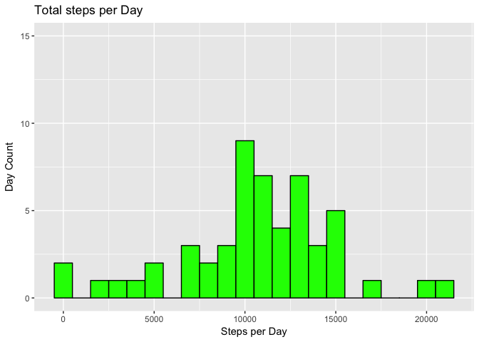
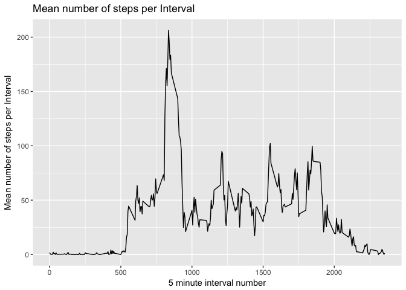
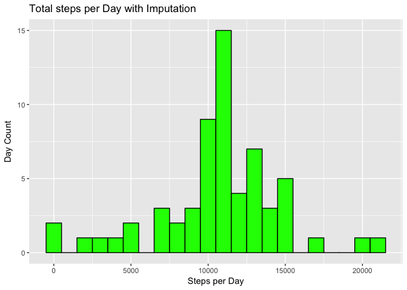
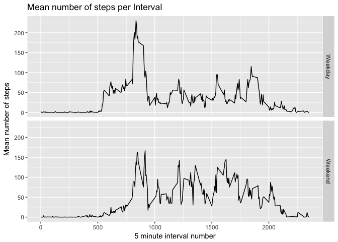

# Reproducible Research: Peer Assessment 1
Joseph Christopher Lavell  


##Overview
Several manufacturers make consumer-wearable products that track activity throughout the day: e.g. fitbit. This is an analysis of data collected from 1 person over 61 days. The data represents the number of steps taken over five minute intervals. A comparison is made between the average of the number of steps per day with and without imputation of missing values. The average steps per interval is also compared between the conglomerated data and the data split by whether the day is a weekday or a weekend day.

##Mean and Median - No Imputation
First look at a histogram showing the total number of steps per day. The R code shows the data being read in and manipulated with the dplyr and lubridate packages.

```r
activity <- read.csv("activity.csv")
activity <- dplyr::mutate(activity, date=lubridate::ymd(date))
stepsPerDay <- activity %>% group_by(date) %>% summarize(stepsPerDay = sum(steps))

g <- ggplot(data=stepsPerDay, aes(stepsPerDay)) + ylim(0,15)
g <- g + geom_histogram(fill="green", color="black",binwidth = 1000)
g + labs(x = "Steps per Day", y = "Day Count", title = "Total steps per Day")
```

```
## Warning: Removed 8 rows containing non-finite values (stat_bin).
```

<!-- -->

The histogram shows a somewhat normal shape.  
Now look at a table of the mean and median of the steps taken per day.

```r
meanspd <- mean(stepsPerDay$stepsPerDay,na.rm = TRUE)
medianspd <- median(stepsPerDay$stepsPerDay, na.rm = TRUE)
df=data.frame(meanStepsPerDay = meanspd, medianStepsPerDay = medianspd)
knitr::kable(df,align = "c", col.names = c("Mean Steps/Day", "Median Steps/Day"), 
             caption = "Average steps per Day")
```


Table: Average steps per Day

 Mean Steps/Day    Median Steps/Day 
----------------  ------------------
    10766.19            10765       

##Average Steps per interval - No imputation
Now look at a line graph showing the average number of steps for each interval. The intervals step by 5. The table below shows the interval with the highest number of steps on average and the number of steps. It corresponds to the large peak on the line graph. The r code first uses dplyr to get the mean steps per interval and then plots using ggplot2. The interval with the highest average number of steps is then found and put in a table.

```r
meanStepsPerInterval <- activity %>% group_by(interval) %>% 
        summarize(meanStepsPerInterval = mean(steps, na.rm = TRUE))
g2 <- ggplot(meanStepsPerInterval, aes(interval, meanStepsPerInterval))
g2 <- g2 + labs(x = "5 minute interval number", y = "Mean number of steps per Interval",
                title = "Mean number of steps per Interval")
g2 + geom_line()
```

<!-- -->

```r
maximum <- max(meanStepsPerInterval$meanStepsPerInterval)
Max <- meanStepsPerInterval %>% filter(meanStepsPerInterval == maximum)
knitr::kable(Max, align = "l", col.names = c("Interval", "Mean Steps/Interval"), 
             caption = "Interval with highest average steps")
```


Table: Interval with highest average steps

Interval   Mean Steps/Interval 
---------  --------------------
835        206.1698            

##Average steps per day - with imputation
The strategy for imputation will be to replace missing values with the mean number of steps for that particular five minute interval over all 61 days.
To impute the missing values first we need to find them. The rcode below does that and prints them in a table.


```r
missingvalues <- sapply(activity, function(x) sum(is.na(x)))
missingvaluedf <- as.data.frame(array(missingvalues,c(1,3)))
colnames(missingvaluedf) <- names(missingvalues)
kable(missingvaluedf,align="c", caption = "Number of missing values before Imputation")
```


Table: Number of missing values before Imputation

 steps    date    interval 
-------  ------  ----------
 2304      0         0     

According to the above, all of the missing values are in the steps column. The r code below computes the average for each interval. It then replaces any missing values with the mean for that interval. The number of missing values is recalculated and the table shows no more missing values.

```r
activity3 <- activity %>% group_by(interval) %>% mutate(intervalmean = mean(steps,na.rm = TRUE))

for(i in seq_along(activity3$steps)){
        if(is.na(activity3$steps[i])){
                activity3$steps[i] <- activity3$intervalmean[i]
        }
}
rm(i)

missingvalues3 <- sapply(activity3, function(x) sum(is.na(x)))
missingvaluedf3 <- as.data.frame(array(missingvalues3,c(1,3)))
colnames(missingvaluedf3) <- names(missingvalues3)[1:3]
kable(missingvaluedf3,align="c", caption = "Number of missing values after Imputation")
```


Table: Number of missing values after Imputation

 steps    date    interval 
-------  ------  ----------
   0       0         0     

Now the first histogram and table are reproduced, this time with imputed values. R code producing these is shown here. 

```r
dailyStepsImpute <- activity3 %>% group_by(date) %>% summarize(sumOfsteps = sum(steps))
g3 <- ggplot(data=dailyStepsImpute, aes(sumOfsteps)) 
g3 <- g3 + labs(x = "Steps per Day", y = "Day Count", title = "Total steps per Day with Imputation")
g3 + geom_histogram(fill="green", color="black",binwidth = 1000)
```

<!-- -->

```r
meanspd <- mean(dailyStepsImpute$sumOfsteps)
medianspd <- median(dailyStepsImpute$sumOfsteps)
df=data.frame(meanStepsPerDay = meanspd, medianStepsPerDay = medianspd)
knitr::kable(df,align = "c", col.names = c("Mean Steps/Day", "Median Steps/Day"), 
             caption = "Average steps per Day with Imputation")
```


Table: Average steps per Day with Imputation

 Mean Steps/Day    Median Steps/Day 
----------------  ------------------
    10766.19           10766.19     

The histogram shows a higher concentration of values about the mean with imputed values as compared to the histogram with no imputation. The mean, however, has not changed, and the median has only changed marginally. It is marginally interesting that the median value is now fractional, as it is not possible with unimputed values to have a fractional median. Maybe a better choice for imputation could have been the median.

##Differences in activity patterns between Weekdays and the Weekend

It may be interesting to see if there is any difference between the level of activity during the week and during the weekend. Two line plots showing average number of steps per interval are shown below. One is averaged over weekend dates and the other over weekday dates. Rcode first gives each observation a value for type of day: either a weekend or weekday. A summary is then generated of average number of steps per interval for each type of day. The data is then plotted using ggplot to compare.

```r
activity4 <- activity3
daytype <- NULL
for(j in seq_along(activity4$date)){
        if(weekdays(activity4$date[j])=="Sunday" | weekdays(activity4$date[j])=="Saturday"){
                daytype[j] <- "Weekend"
        } else{
                daytype[j] <- "Weekday"
        }
}
activity4$daytype <- as.factor(daytype)
avgstepPerInterval <- activity4 %>% group_by(daytype,interval) %>% 
        summarize(avgsteps = mean(steps))

g4 <- ggplot(avgstepPerInterval, aes(interval, avgsteps))
g4 <- g4 + facet_grid(daytype ~.) + geom_line()
g4 + labs(x = "5 minute interval number", y = "Mean number of steps",
                title = "Mean number of steps per Interval")
```

<!-- -->

The graphs shows increased overall activity througout the day on the weekend, however, more intense early morning activity througout the week.

#Conclusion
The intention of this study was to compare daily activity over 2 months of a particular individual using the number of steps per day gathered by an activity monitor as a metric. 
The data was studied with and without imputation of missing values using the mean of the number of steps over a particular interval in the imputation. Without imputation, the number of steps per day was spread out. Imputation caused a greater concentration of observations near the average. The number of steps per interval across an average day was observed as well, showing a large average amount of activity in the morning and lower activity during the day. The data was also split into groups representing observations over the weekend and observations over the weekdays. A high level of activity was observed in the morning of weekdays with lower activity throughout the rest of the day. However on the Weekend more overall activity was observed without as large a spike in the morning.
